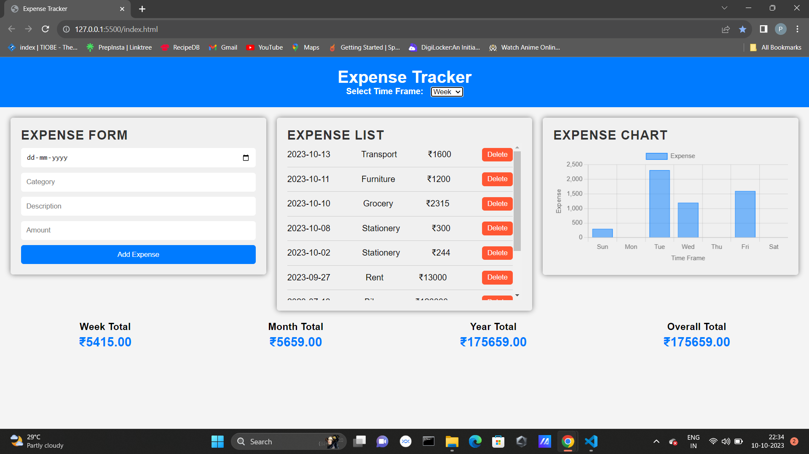
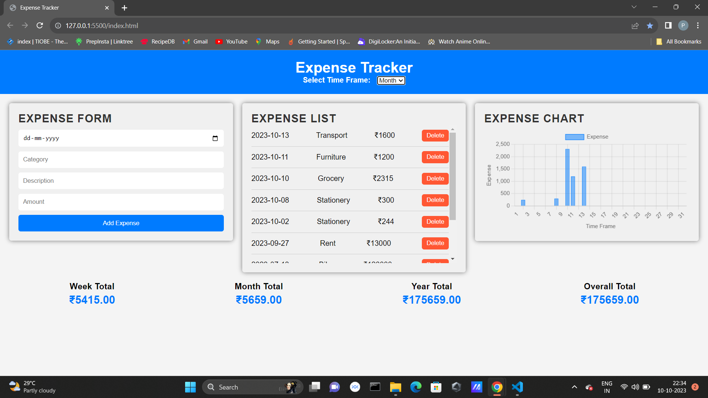

# Expense Tracker

Expense Tracker is a web application that allows you to manage and track your expenses. You can add, delete, and categorize your expenses, view them in a list, and see visualizations of your spending habits over different time frames.

## Table of Contents

- [Demo](#demo)
- [Features](#features)
- [Screenshot](#screenshot)
- [State Management](#state-management)
- [Visualization](#visualization)
- [Getting Started](#getting-started)
  - [Prerequisites](#prerequisites)
  - [Installation](#installation)
- [License](#license)

## Demo

You can try the live demo of the Expense Tracker here: [Live Demo](#)

## Features

- Add, delete, and categorize expenses.
- View expenses in a list.
- Visualize expenses over different time frames (week, month, year).
- User-friendly and responsive design.

## Screenshot

### Week Expenses Chart


### Month Expenses Chart


### Year Expenses Chart


## State Management

Expense Tracker uses state management techniques to keep track of the expenses and update the user interface dynamically. It efficiently manages the state of the application, ensuring that the user's interactions with the app are reflected accurately.

## Visualization

Expense Tracker leverages visualization libraries and techniques to provide meaningful insights into your spending habits. It uses Chart.js to create interactive charts that visually represent your expenses over different time frames, making it easier to understand your financial data.

## Getting Started

To run this project locally, follow these steps:

### Prerequisites

You need a web browser to open the HTML file.

### Installation

1. Clone the repository to your local machine:

   ```bash
   git clone https://github.com/YourUsername/Expense-Tracker.git
